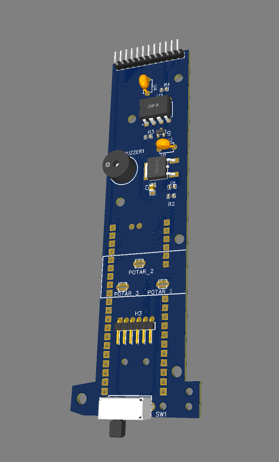

#Flyingohm
__FlyingOhm Remote Source Code__

## 1. Overview of FlyingOhm
FlyingOhm is an electric paramotor project (ULM class 1).

The paramotor consists of : a frame, a motor (with propeller), a battery, a motor controller and a remote control.

Link to facebook page: https://www.facebook.com/FlyingOhm/

Link to the youtube page: https://youtube.com/@SebastienGOSSE

## 2. Presentation of the FlyingOhm project
The project concerns the source code of the remote control which allows (among other things):

-To control the motor via the potentiometer

- To display useful data to the pilot (State of the engine, autonomy, duration of flight, etc.)

## 3. Features
### States and modes
There are 3 states: INIT, DISARMED, ARMED

In the Init state, the FlyingOhm logo is displayed as well as the firmware version.

In Disarmed state, the remote sends a PWM of 1000us (motor OFF)

In the Armed state, the remote control sends the setpoint returned by the potentiometer to the controller

The transition from the Init state to Disarmed is done automatically after a few seconds.

The transition from the Disarmed to Armed state occurs when the pilot has pressed the push button (long press)

The passage from the Armed state to Disaremd takes place when the pilot presses briefly on the push button.

A safety switch is present under the remote control. If this is activated, the remote control is no longer powered and the controller no longer receives a PWM signal => The motor stops.

### PWM signal
The PWM signal is the main element to be sent to the motor controller.

The PWM has a frequency of 50Hz (signal duration of 1000us = 0%, 2000us = 100%)

### Screen display
The screen is divided into different areas as shown in the image below:

  

### Reading controller data
The controller sends a UART signal containing several interesting information to exploit, in particular:

-Total battery voltage

-Controller temperature

-The instantaneous current

Controller documentation reference: https://docs.powerdrives.net/products/hv_pro/uart-telemetry-output

## 4. BOM and Pinout
The project consists of (among others):

-a raspberry pico pi

- an ST7735R screen

-a potentiometer connected to GP27

- a lighted push button connected to GP15 (GP14 for button lighting)

-a buzzer connected to GP12

## 5.PCB
Two PCBs exist: the first for the main handle which contains the pico pi and the potentiometer.

  
  

The second PCB integrates the screen as well as the push button. This second PCB is soldered vertically on the main PCB.

  

## 6. 3D printing of the remote control
The remote control is then printed in 3D and integrates the PCBs, as well as the electric cable connected to the controller.

  
  

## Environment, code and flash of the raspberry pico pi
The IDE used to develop is Thonny.

The interpreter used is circuipython for Rapsberry Pico pi

__Facility__ :

-Connect the Pico Pi via USB to the PC.

-Launch Thonny (when using a pico pi for the first time, you will need to install micropython on the pico pi)

-Copy the libraries/dependencies on the pico pi (librairies, fonts, etc.)

-Open the main.py on Thonny, and execute the scipt (green arrow)

